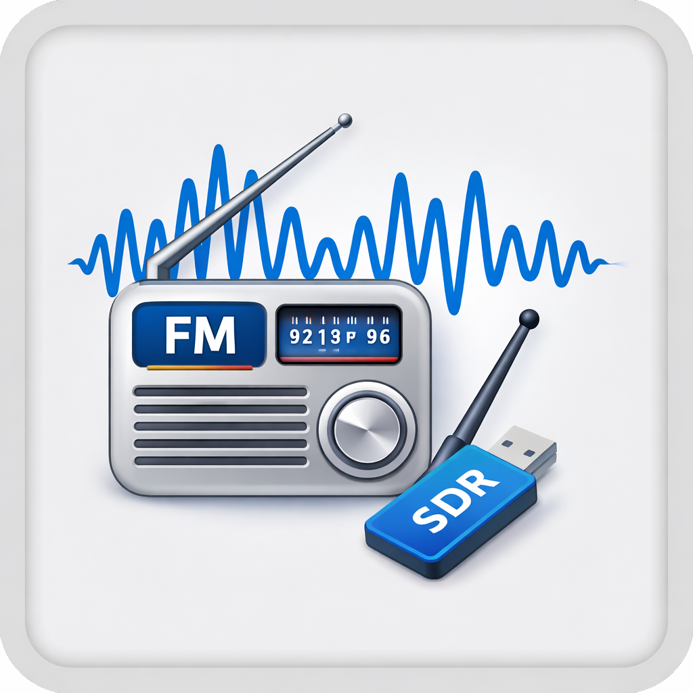

# Lyrion_FM_Radio
Stream FM radio to Lyrion Music Server, inclusive the option to change frequency

FM Radio reception via RTL-SDR for Lyrion Music Server (LMS).

Receives FM radio using an RTL-SDR USB dongle and [NGSoftFM](https://github.com/f4exb/ngsoftfm), streams it to an Icecast server, and exposes an HTTP API for tuning. An LMS plugin integrates it into the Radio menu with a configurable station list.



---

## Architecture

```
RTL-SDR dongle
      ↓
   NGSoftFM  (FM demodulation, stereo PCM)
      ↓
  named pipe
      ↓
   ffmpeg  (encode to MP3)
      ↓
   Icecast  (HTTP audio stream)
      ↑
 fm-daemon  (HTTP API — tuning control)
      ↑
 LMS Plugin  (Radio menu, station list, settings)
```

---

## RTL-SDR dongle

RTL-SDR is a type of software-defined radio (SDR) that uses a cheap DVB-T TV tuner dongle as a wideband radio receiver. Originally designed for receiving digital TV, these dongles can be repurposed to receive a wide range of radio signals — including FM radio — when used with the right software. A basic dongle from China costing around 10 EUR works perfectly fine for FM reception.

### Blacklisting the DVB kernel drivers (recommended)

Linux automatically loads the `dvb_usb_rtl28xxu` and `rtl2832` kernel drivers when you plug in an RTL-SDR dongle. These drivers claim the device and can prevent SDR software from accessing it.

The most reliable fix is to blacklist those drivers on the host:

```bash
echo -e "blacklist dvb_usb_rtl28xxu\nblacklist rtl2832\nblacklist rtl2830" \
    | sudo tee /etc/modprobe.d/blacklist-rtlsdr.conf
sudo modprobe -r dvb_usb_rtl28xxu rtl2832 rtl2830   # unload if currently loaded
```

Re-plug the dongle and verify with `rtl_test`.

> **Docker users:** Blacklisting is still recommended, but not strictly required. The Docker container runs in privileged mode, which lets librtlsdr call `libusb_detach_kernel_driver()` and claim the dongle from the DVB driver automatically. This works in most cases — but blacklisting avoids any edge cases, especially after re-plugging the dongle.

---

## Option A — Docker (recommended for new users)

This is the easiest way to get started. Everything runs in a single container: NGSoftFM, ffmpeg, and Icecast are all included — no manual software installation needed.

### Prerequisites

- Docker and Docker Compose installed
- RTL-SDR dongle connected to the host
- DVB kernel drivers blacklisted (see above — optional but recommended)

### Quickstart

```bash
git clone https://github.com/macsatcom/Lyrion_FM_Radio.git
cd Lyrion_FM_Radio/docker
```

Edit `docker-compose.yml` and change the passwords and startup frequency:

```yaml
environment:
  ICECAST_SOURCE:      changeme          # pick a source password
  ICECAST_ADMIN_PASS:  changeme_admin    # pick an admin password
  STARTUP_FREQ:        "90800000"        # startup frequency in Hz (90.8 MHz)
  RTL_DEVICE:          "0"              # RTL-SDR device index (0 = first dongle)
```

Then build and start:

```bash
docker compose up --build
```

The first build takes a few minutes (NGSoftFM is compiled from source). Subsequent starts are fast.

Once running:
- FM Daemon API: `http://<host-ip>:8080`
- Icecast stream: `http://<host-ip>:8000/fm`

### Using an existing Icecast server

If you already have an Icecast server running on your network, you can skip the built-in one and push the stream there instead. Set `ICECAST_MODE=external` and point `ICECAST_HOST` at your server:

```yaml
environment:
  ICECAST_MODE:        external
  ICECAST_HOST:        192.168.1.50      # IP or hostname of your Icecast server
  ICECAST_PORT:        "8000"
  ICECAST_MOUNT:       /fm
  ICECAST_SOURCE:      your-source-password
  STARTUP_FREQ:        "90800000"
  RTL_DEVICE:          "0"
```

In this mode Icecast is not started inside the container, so you can also remove the `- "8000:8000"` port mapping from `docker-compose.yml` — listeners connect directly to your existing server instead.

> **Note:** `ICECAST_ADMIN_PASS` is only used by the built-in Icecast instance and can be omitted when `ICECAST_MODE=external`.

#### Using a `.env` file

Instead of editing `docker-compose.yml` directly, you can copy the provided example file and fill it in:

```bash
cp docker/.env.example docker/.env
# edit docker/.env
docker compose --env-file .env up --build
```

### Multiple RTL-SDR dongles

If you have more than one dongle connected, set `RTL_DEVICE` to the index of the one you want to use (`0`, `1`, `2`, …). Run `rtl_test` on the host to list connected devices and their indices.

### Stopping

```bash
docker compose down
```

---

## Option B — Manual installation

Use this if you prefer to run the daemon directly on your server without Docker, or if you already have NGSoftFM and Icecast set up.

### Prerequisites

- Linux server (Debian/Ubuntu recommended)
- RTL-SDR USB dongle connected and working
- [NGSoftFM](https://github.com/f4exb/ngsoftfm) built and installed
- `ffmpeg` installed (`apt install ffmpeg`)
- Icecast2 server running (`apt install icecast2`)
- Lyrion Music Server 8.x or 9.x

> **Note:** Getting your RTL-SDR dongle working and building NGSoftFM is outside the scope of this guide. See the [rtl-sdr quickstart](https://www.rtl-sdr.com/rtl-sdr-quick-start-guide/) and the [NGSoftFM README](https://github.com/f4exb/ngsoftfm) for instructions. Verify your setup works by running `softfm -t rtlsdr -c freq=90800000 -R -` before proceeding.

### 1. Configure

Edit `daemon/fm-daemon.py` and fill in the configuration section at the top:

```python
SOFTFM_BIN         = "/usr/local/bin/softfm"       # path to your softfm binary
ICECAST_HOST       = "your-icecast-host"            # Icecast hostname or IP
ICECAST_PORT       = 8000                           # Icecast port
ICECAST_MOUNT      = "/fm"                          # Icecast mount point
ICECAST_SOURCE     = "your-source-password"         # Icecast source password
ICECAST_ADMIN_USER = "admin"                        # Icecast admin username
ICECAST_ADMIN_PASS = "your-admin-password"          # Icecast admin password
DAEMON_PORT        = 8080                           # port for this daemon's HTTP API
STARTUP_FREQ       = 90800000                       # startup frequency in Hz
```

### 2. Install

```bash
sudo cp daemon/fm-daemon.py /usr/local/bin/fm-daemon.py
sudo chmod +x /usr/local/bin/fm-daemon.py
```

### 3. Install as a systemd service

```bash
sudo cp daemon/fm-daemon.service /etc/systemd/system/
sudo systemctl daemon-reload
sudo systemctl enable fm-daemon
sudo systemctl start fm-daemon
```

Check that it is running:

```bash
sudo systemctl status fm-daemon
```

### Multiple RTL-SDR dongles

If you have more than one dongle connected, use the `--device` / `-d` flag to select which one to use:

```bash
# List connected devices
rtl_test

# Run daemon on device index 1
python3 /usr/local/bin/fm-daemon.py --device 1
```

To make this permanent, add `--device 1` to the `ExecStart` line in `daemon/fm-daemon.service`.

### 4. Test the API

```bash
# Check status
curl http://localhost:8080/status

# Tune to 93.9 MHz and redirect to stream
curl -L http://localhost:8080/listen/93.9

# Tune via POST
curl -X POST "http://localhost:8080/tune?freq=93900000"

# Stop
curl -X POST http://localhost:8080/stop
```

---

## API reference

| Method | Path | Description |
|--------|------|-------------|
| GET | `/status` | Returns current status and frequency as JSON |
| GET | `/listen/90.8` | Tune to 90.8 MHz, redirect to Icecast stream |
| GET | `/listen/90800000` | Same, using Hz |
| POST | `/tune?freq=90800000` | Tune without redirect |
| POST | `/stop` | Stop reception |

---

## LMS Plugin Installation

### Manual install

1. Copy the `LMSPlugin/FMRadio` folder into your LMS plugin directory:
   - Docker LMS: `/config/cache/Plugins/FMRadio`
   - Standard: `/usr/share/squeezeboxserver/Plugins/FMRadio`

2. Restart LMS.

### Via external repository

Add the following URL in LMS under **Settings → Plugins → Add repository**:

```
https://raw.githubusercontent.com/macsatcom/Lyrion_FM_Radio/main/repo.xml
```

After adding the repository, FM Radio will appear in the plugin list and can be installed from there.

### Plugin configuration

After installation, go to **Settings → Plugins → FM Radio → Settings** and configure:

- **Daemon URL** — URL to your fm-daemon, e.g. `http://192.168.1.10:8080`
- **Icecast Stream URL** — URL to your Icecast stream, e.g. `http://192.168.1.10:8000/fm`
- **Stations** — list of stations in `name|MHz` format, one per line:

```
DR P1|90.8
DR P3|93.9
DR P4 København|96.5
Radio 100|100.0
```

The plugin will appear under **Radio → FM Radio** in LMS.

---

## License

GNU GPL
